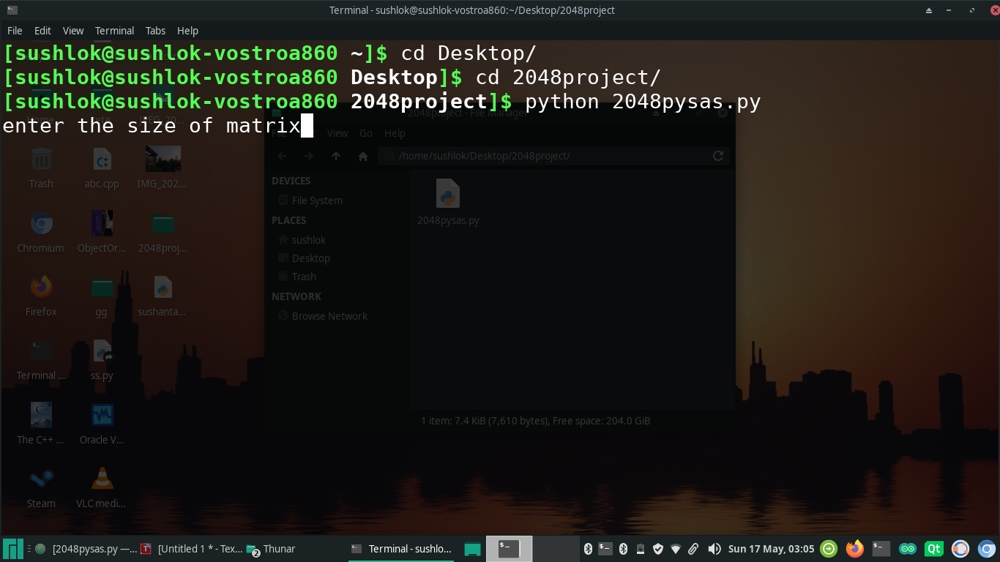
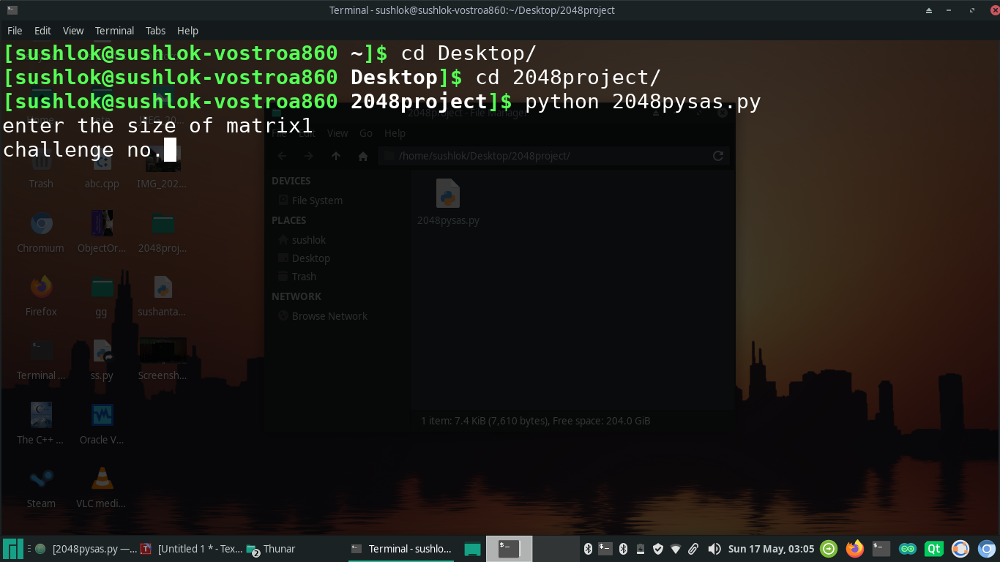
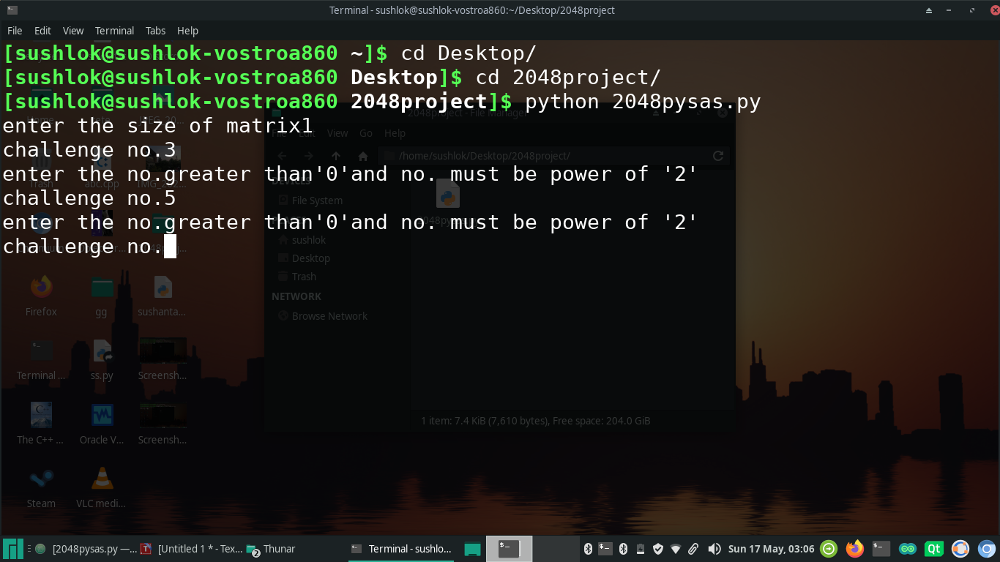
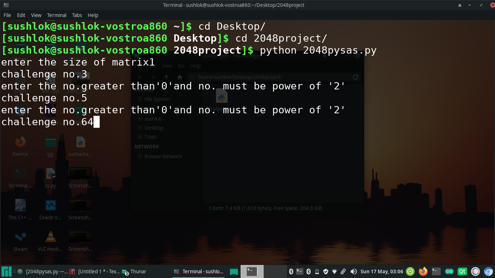
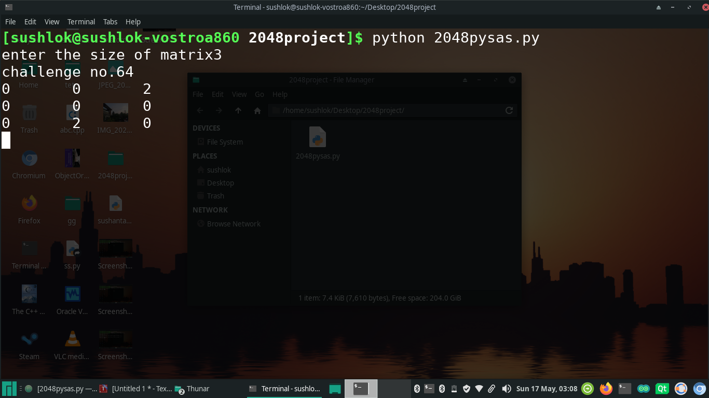
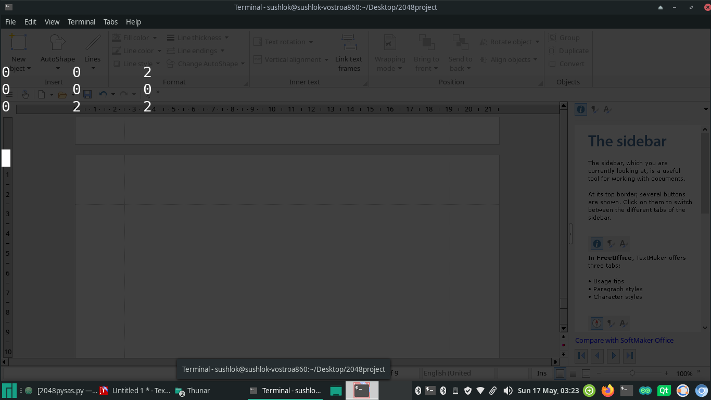
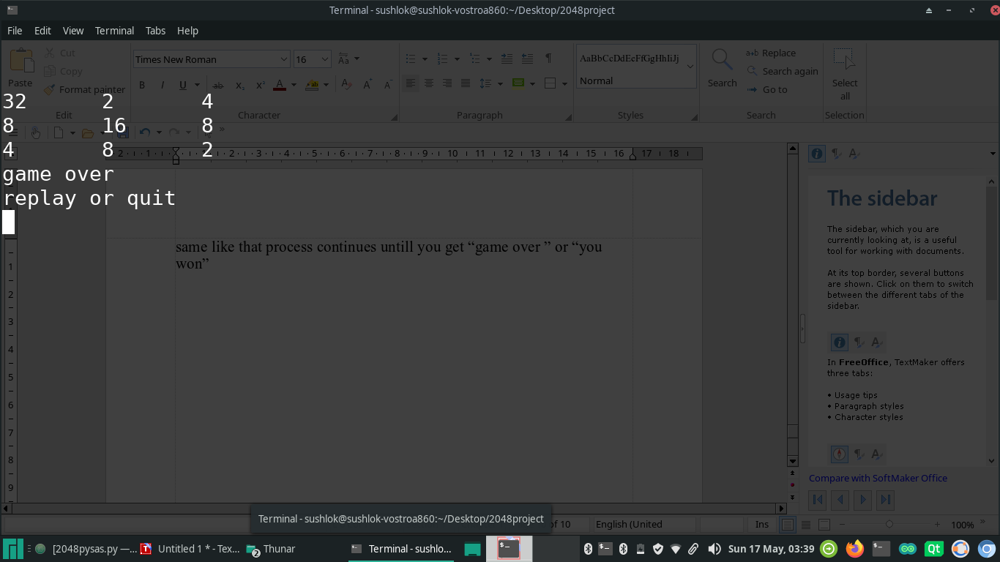
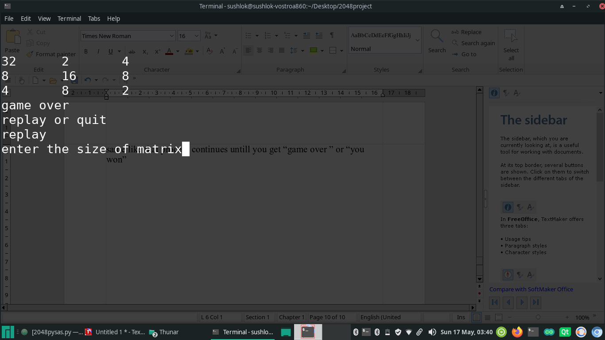
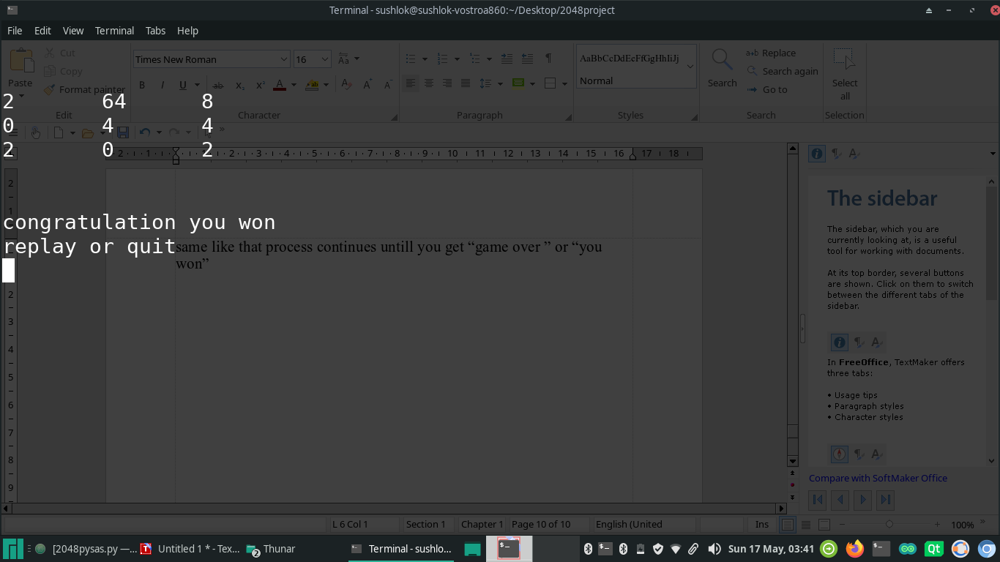
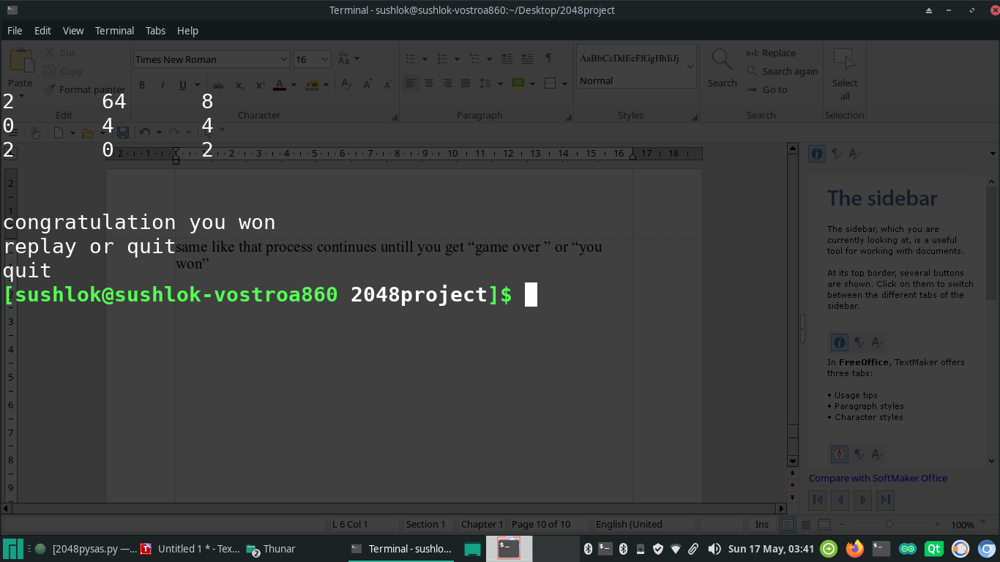

# py2048
 <h1>2048 python                                                                    code explanation</h1>
 
 
 
<b>from os import system,name</b>

imports system name and os and useful in giving cammands to the terminal

<b>from time import sleep</b>
 
used for stoping cammand from system for specific time

<b>import msvcrt</b>

library for windows for geting single char. from terminal(cmd)

<pre><b>def getch(): 
        import sys  
        import tty  
        import termios  
        fd = sys.stdin.fileno()  
        old = termios.tcgetattr(fd)  
        try:  
            tty.setraw(fd)  
            return sys.stdin.read(1)  
        finally:  
            termios.tcsetattr(fd, termios.TCSADRAIN, old)  </b></pre>

used for getting single char. from terminal (linux and mac)

<pre><b>def  clear():  
    if name =="nt":  
        _ =system('cls')  
    else:  
        _ = system('clear')  </b></pre>

for clearing terminal screen
 
import random

standard library for getting random number supporting different functions for random no.

<pre><b>def matrixsize():  
    global n  
    n=int(input("enter the size of matrix"))  
    if n == 0:  
        print("enter the no.greater than'0' ")  
        matrixsize()  
    return n  </b></pre>

function defined for getting matrix size

<pre><b>def callengenum():  
    global p  
    p=int(input("callenge no."))  
    po=0  
    while(p>2**po):  
        po=po+1   
    if p==0 or p!=2**po:  
        print("enter the no.greater than'0'and no. must be power of '2' ")  
        callengenum()  
    return p  </b></pre>

function for getting challenged no.

<pre><b>def myprint(k,n):  
    for i in range(n):  
        for j in range(n):  
            print(k[i][j],"\t",end="")  
        print()  </b></pre>

function for printing matrix of given size

<pre><b>def maxnum(k,n):  
    global x   
    x=0  
    for i in range(0,n):  
        for j in range(0,n):  
            if k[i][j]>x: 
                x=k[i][j]  
 
    return x </b></pre>

function for finding maximum number from matrix k

<pre><b>def randomplace(k,n):  
    global ajay  
    global shah  
    x=random.randrange(0,n)  
    y=random.randrange(0,n)  
    if k[x][y]==0:  
        if n==2: 
            k[x][y]=2  
        else: 
            k[x][y]=2*random.randrange(1,3)  
        ajay=x  
        shah=y  
 
    else: 
        randomplace(k,n) </b></pre>

function for placing 2 or 4 at random place in matrix

def move(k,n,dir):
    global z
    z=[]
    for i in range(n):
        s=[]
        for j in range(n):
            s.append(k[i][j])
        z.append(s)

    if dir=="d"or dir=="D":
        for i in range(n):
            for l in range(n):
                for j in range(n-l-1):
                    if(k[i][j]!=0 and k[i][j+1]==0):
                        temp=k[i][j+1]
                        k[i][j+1]=k[i][j]
                        k[i][j]=temp
        for i in range(n):
            for j in range(n):
                if k[i][n-1-j]==k[i][n-2-j]:
                    k[i][n-1-j]=2*k[i][n-1-j]
                    for p in range(0,n-j-2):
                        k[i][n-j-2-p]=k[i][n-j-3-p]
                    k[i][0]=0

    if dir=="a" or dir=="A":
         for i in range(n):
             for l in range(n):
                 for j in range(n-l-1):
                     if(k[i][j]==0 and k[i][j+1]!=0):
                         temp=k[i][j]
                         k[i][j]=k[i][j+1]
                         k[i][j+1]=temp
         for i in range(n):
             for j in range(n-1):
                 if k[i][j]==k[i][j+1]:
                     k[i][j]=2*k[i][j]
                     for p in range(j+1,n-1):
                         k[i][p]=k[i][p+1]
                     k[i][n-1]=0

    if dir=="w" or dir=="W":
         for i in range(n):
             for l in range(n-1):
                 for j in range(n-l-1):
                     if(k[j][i]==0 and k[j+1][i]!=0):
                         temp=k[j][i]
                         k[j][i]=k[j+1][i]
                         k[j+1][i]=temp
         for i in range(n):
             for j in range(n-1):
                 if k[j][i]==k[j+1][i]:
                     k[j][i]=2*k[j][i]
                     for p in range(j+1,n-1):
                         k[p][i]=k[p+1][i]
                     k[n-1][i]=0

    if dir=="s" or dir=="S":
         for i in range(n):
             for l in range(n-1):
                 for j in range(n-l-1):
                     if(k[j][i]!=0 and k[j+1][i]==0):
                         temp=k[j+1][i]
                         k[j+1][i]=k[j][i]
                         k[j][i]=temp
         for i in range(n):
             for j in range(n):
                 if k[n-1-j][i]==k[n-2-j][i]:
                     k[n-1-j][i]=2*k[n-1-j][i]
                     for p in range(0,n-j-2):
                         k[n-j-2-p][i]=k[n-j-3-p][i]
                     k[0][i]=0
    global check
    check=0
    if z==k:
        check=check+1

    print("\n")

function which takes input fromdir and moves the element of matrix
on input  w,a,s,d

<pre>def getinput():
    if name =="nt":
        dir=msvcrt.getch()
        char=dir[0]
        dir=chr(char)
    else:
        dir=getch()
    return dir</pre>

function for getting input (w,a,s,d)

<h1>working of code</h1>

1)enter the command “python 2048pysas.py” in terminal  
2)enter the matrix size 
 
3)enter the challenge no  
 

4)it will check whether it is power of 2 and no. is greater than 0. 
  else it will call again function  
 
  
5) after getting the terms it will display matrix with random 2’s or 4’s  
   for matrix of size "1" it will take input and it will compare the given no. with the random no. and then it will display "win" condition if given no. is same as the random no. 
  
6) depending upon direction move function will move the matrix  
 
inputs example  

d  

d  

same like that process continues untill you get “game over ” or “you won”  
it will ask “replay” or “quit”  

